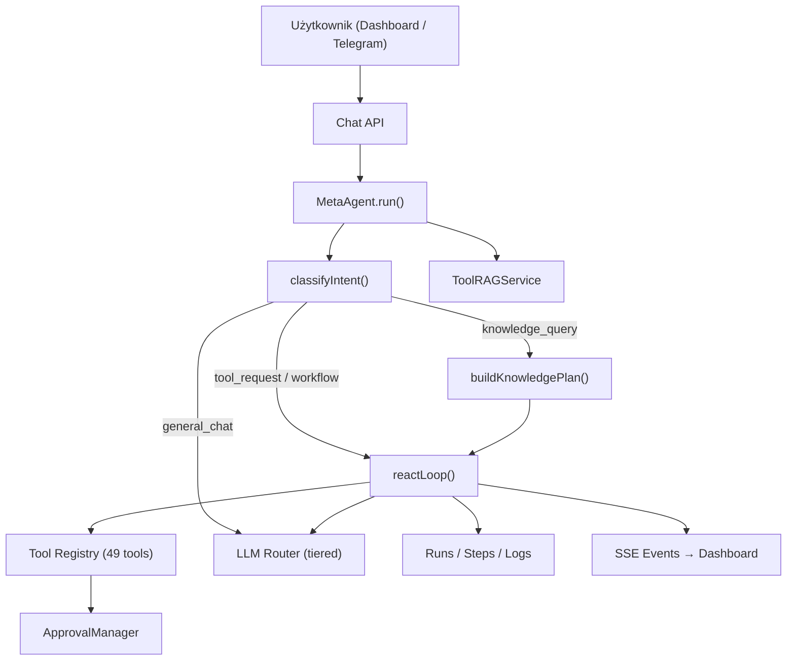
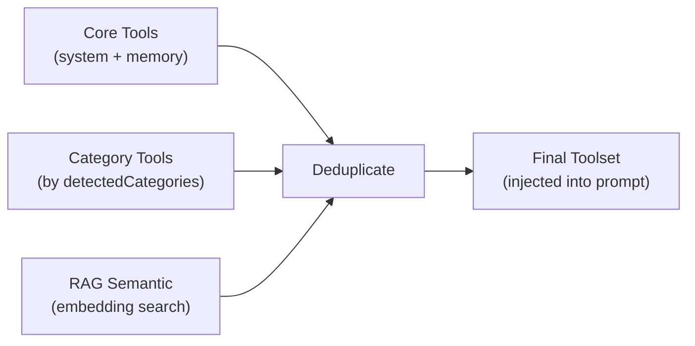
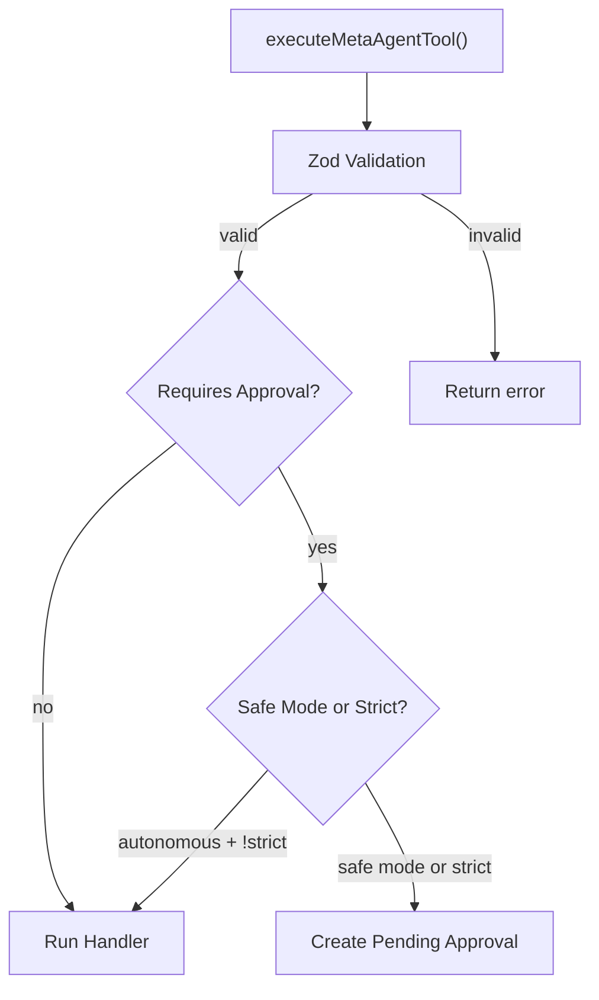

# 🔍 Meta Agent — Pełny Audyt Architektoniczny

> **Zakres:** ReAct loop, selekcja narzędzi, routing domen, prompty, bezpieczeństwo, obsługa błędów  
> **Pliki:** ~15 kluczowych modułów · ~5,500 linii kodu · 49 narzędzi · 7 domen · 16 notatników

---

## 1. Architektura Wysokopoziomowa



### Przepływ danych krok po kroku:

1. **Wejście** → `MetaAgent.run()` otrzymuje wiadomość z `threadId`, `activeDomain`, historia konwersacji
2. **Intent Classification** → `classifyIntent()` (LLM + heurystyczny fallback)
3. **Knowledge Plan** → Dla `knowledge_query`: selektywny wybór notatników NotebookLM
4. **Dynamic Toolset** → `ToolRAGService` buduje zestaw narzędzi: core + category + RAG semantic
5. **ReAct Loop** → Iteracyjne `thought → action → observation` z limitem 15 kroków
6. **Tool Execution** → Zod walidacja → Approval check → Handler execution
7. **Output** → `parseFinalResponse()` → `meta:complete` SSE → MongoDB persist

---

## 2. ReAct Loop — Analiza Szczegółowa

[react-loop.ts](file:///projekty/jarvis-dashboard-agent/apps/workers/src/agents/meta-agent/react-loop.ts)

### ✅ Co działa dobrze

| Aspekt | Ocena | Szczegóły |
|--------|-------|-----------|
| **Cancellation** | ✅ Solidne | Sprawdzenie `task.status === 'cancelled'` na początku każdej iteracji |
| **JSON Repair** | ✅ Solidne | 2-fazowy pipeline: `repairJSON()` → LLM repair z dedykowanym promptem |
| **Heartbeat** | ✅ Solidne | `setInterval` co 4s podczas długich narzędzi + `meta:progress` events |
| **Live State** | ✅ Solidne | `persistLiveState()` na każdym kroku dla UI restoration |
| **Telemetry** | ✅ Solidne | Granularne `saveRunStep()` + `publishEvent()` na każdym etapie |
| **Approval Break** | ✅ Solidne | `break` po `pendingApproval` — nie kontynuuje niepotrzebnie |

### ⚠️ Zidentyfikowane Ryzyka

#### 2.1 [KRYTYCZNE] Brak timeout per-tool call

```typescript
// react-loop.ts:189 — brak timeoutu!
result = await params.tools.execute(toolName, toolArgs, params.taskId)
```

**Problem:** Jeśli narzędzie (np. `chef.generate_menu`, `knowledge.query`, `subtask.delegate_loop`) zawiesi się, cała pętla ReAct zablokuje się na nieokreślony czas. Heartbeat `setInterval` zgłasza progres, ale nie ma mechanizmu przerwania.

**Rekomendacja:**
```typescript
const TOOL_TIMEOUT_MS = 120_000 // 2 min default
const toolTimeout = TOOL_TIMEOUTS[toolName] ?? TOOL_TIMEOUT_MS

result = await Promise.race([
  params.tools.execute(toolName, toolArgs, params.taskId),
  new Promise((_, reject) => 
    setTimeout(() => reject(new Error(`Tool ${toolName} timed out after ${toolTimeout}ms`)), toolTimeout)
  )
])
```

#### 2.2 [WYSOKIE] Observation truncation ukrywa krytyczne dane

```typescript
// react-loop.ts:34
s.observation.length > 2000 ? s.observation.slice(0, 2000) + '... [skrócono]' : s.observation
```

**Problem:** Dla narzędzi zwracających duże payloady (np. `crm.search_leads` z wieloma leadami, `n8n.get_workflow` z pełnym JSON) obcięcie na 2000 znaków może usunąć kluczowe dane, powodując że agent nie "widzi" wyników i powtarza zapytanie.

**Rekomendacja:** Inteligentne streszczanie zamiast brutalnego obcinania:
```typescript
function smartTruncate(obs: string, toolName: string, maxLen = 3000): string {
  if (obs.length <= maxLen) return obs
  // Dla tool calls zwracających JSON array — zachowaj count + pierwsze N
  try {
    const data = JSON.parse(obs)
    if (Array.isArray(data)) {
      return JSON.stringify({ _truncated: true, total: data.length, items: data.slice(0, 5) })
    }
  } catch {}
  return obs.slice(0, maxLen) + '... [skrócono]'
}
```

#### 2.3 [ŚREDNIE] Brak akumulacji kosztu w pętli

Pętla nie śledzi łącznych tokenów/kosztu per-step. Jeśli agent wykonuje 15 kroków z `react-step` + tool calls, brak mechanizmu "cost budget" pozwala na niekontrolowane zużycie API credits.

**Rekomendacja:** Dodać akumulator kosztu + próg ostrzegawczy:
```typescript
let totalCostUsd = 0
const COST_BUDGET = parseFloat(process.env.REACT_LOOP_COST_BUDGET || '2.0')

// Po callLLM
totalCostUsd += response.costUsd
if (totalCostUsd > COST_BUDGET) {
  return { finalAnswer: `⚠️ Przekroczono budżet kosztowy pętli ($${totalCostUsd.toFixed(3)}). Przerywam.`, ... }
}
```

#### 2.4 [ŚREDNIE] DB query na każdej iteracji dla plan/status

```typescript
// react-loop.ts:37-38 — KAŻDA iteracja robi MongoDB query
const db = await (params.agent as any).getDb()
const task = await db.collection('tasks').findOne({ taskId: params.taskId }, ...)
```

Przy 15 iteracjach to 15 dodatkowych roundtrips do MongoDB. Plan i status powinny być cache'owane w pamięci i odświeżane co N iteracji.

---

## 3. Selekcja Narzędzi — Tool Discovery Pipeline

[index.ts:790-836](file:///projekty/jarvis-dashboard-agent/apps/workers/src/agents/meta-agent/index.ts#L790-L836) · [tool-rag-service.ts](file:///projekty/jarvis-dashboard-agent/apps/workers/src/agents/meta-agent/tool-rag-service.ts)

### 3-warstwowy pipeline selekcji:



### ✅ Mocne strony

- **Deduplication** przez `Map<string, any>` eliminuje duplikaty z 3 warstw
- **Category detection** z `SYSTEM_DOMAINS[].categories` gwarantuje trafność kontekstową
- **Progresywne ujawnianie** — `system.load_tool_schema` pozwala agentowi poznać szczegóły przed wywołaniem
- **Minimalny próg** RAG: `MIN_SIMILARITY = 0.35` (wystarczająco selektywny)

### ⚠️ Zidentyfikowane Ryzyka

#### 3.1 [WYSOKIE] Brak walidacji spójności toolName z TOOL_HANDLERS

```typescript
// tool-definitions.ts: 49 definicji
export const META_AGENT_TOOL_DEFINITIONS: MetaAgentToolDefinition[] = [...]

// tool-registry.ts: handlers
const TOOL_HANDLERS: Record<string, MetaAgentToolHandler> = { ... }
```

**Problem:** Nie ma compile-time ani runtime sprawdzenia, czy każda definicja ma odpowiedni handler i odwrotnie. Dodanie nowego narzędzia do `tool-definitions.ts` bez odpowiedniego handlera w `tool-registry.ts` spowoduje cichy `{ success: false, error: 'Unknown tool' }` w runtime.

**Rekomendacja:** Dodać startup validation:
```typescript
// W inicjalizacji workera:
const definedTools = new Set(META_AGENT_TOOL_DEFINITIONS.map(t => t.name))
const handledTools = new Set(Object.keys(TOOL_HANDLERS))

const missingHandlers = [...definedTools].filter(t => !handledTools.has(t))
const orphanHandlers = [...handledTools].filter(t => !definedTools.has(t))

if (missingHandlers.length > 0 || orphanHandlers.length > 0) {
  throw new Error(`Tool registry mismatch! Missing handlers: [${missingHandlers}], Orphan handlers: [${orphanHandlers}]`)
}
```

#### 3.2 [ŚREDNIE] RAG cosine similarity wykonywana w pamięci

```typescript
// tool-rag-service.ts:299-309
const allTools = await this.collection.find(filter).toArray()
const scored = allTools
  .map(t => ({ name: t.name, description: t.description, score: embeddingService.cosineSimilarity(embedding!, t.embedding) }))
```

**Problem:** Przy rosnącym rejestrze (~50+ narzędzi + n8n workflows + skills + notebooks) ładowanie WSZYSTKICH embeddings do pamięci i obliczanie cosine similarity na CPU jest nieefektywne.

**Rekomendacja:** Migracja do MongoDB Atlas Vector Search (`$vectorSearch` aggregation) lub narzędzie indeksowania wektorowego w pamięci (np. `hnswlib-node`).

#### 3.3 [NISKIE] `system.search_tools` ma niższy próg niż automatyczny RAG

```typescript
// Automatyczny RAG: MIN_SIMILARITY = 0.35
// system.search_tools handler: minScore: 0.25
```

Jest to celowe (agent świadomie szuka), ale może prowadzić do wyświetlania narzędzi o marginalnej trafności.

---

## 4. Domain Routing — SYSTEM_DOMAINS

[agentConfig.ts:237-288](file:///projekty/jarvis-dashboard-agent/packages/shared/src/agentConfig.ts#L237-L288)

### ✅ Architektura

6 domen z precyzyjnym mapowaniem `categories → tools`:

| Domain | Categories | Instrukcja |
|--------|-----------|------------|
| `marketing` | communication, knowledge | Outreach, Gmail, Calendar |
| `research` | knowledge | NotebookLM deep research |
| `crm` | crm | Lead management, pipeline |
| `terminal` | system | Shell, fs, sub-agents |
| `automation` | automation | n8n workflows |
| `chef` | chef, knowledge | Menu engineering |

### ⚠️ Zidentyfikowane Ryzyka

#### 4.1 [WYSOKIE] Domain context "forgetting" w follow-up messages

> **Udokumentowane wcześniej w konwersacji [26930f31]** — `MetaAgentChat.tsx` nie propaguje `activeDomain` w follow-up messages, powodując revert do "none".

**Status:** Znany problem, wymaga fix w API/frontend.

#### 4.2 [ŚREDNIE] Brak domeny "none" w SYSTEM_DOMAINS

Gdy `activeDomain` jest `undefined` lub `'none'`, system nie injektuje żadnego domain-specific instruction. To jest poprawne zachowanie, ale nie jest udokumentowane jako świadoma decyzja. Brak fallback'u sprawia, że agent operuje bez kontekstu domenowego.

#### 4.3 [NISKIE] Chef domain `instruction` jest bardzo długi

```typescript
// agentConfig.ts:278-286 — 6 szczegółowych reguł inline
instruction: `Działaj jako profesjonalny Head Chef...`
```

Lepiej byłoby przenieść do dedykowanego pliku (tak jak jest `chef-domain.md`), ale obecna duplikacja oznacza, że instruction z `SYSTEM_DOMAINS` jest zawsze wstrzykiwany, a `chef-domain.md` jest ładowany warunkowo. Mogą się rozjechać.

---

## 5. Prompty — Analiza Spójności

### 5.1 Mapa promptów

| Prompt File | Cel | Temperatura | Model Tier |
|-------------|-----|-------------|------------|
| [intent-router.md](file:///projekty/jarvis-dashboard-agent/apps/workers/src/agents/meta-agent/prompts/intent-router.md) | Klasyfikacja intencji | 0.1 | gpt-5.4-mini / flash |
| [react.md](file:///projekty/jarvis-dashboard-agent/apps/workers/src/agents/meta-agent/prompts/react.md) | System prompt pętli ReAct | 0.1 | gpt-5.4-mini / flash |
| [chef-domain.md](file:///projekty/jarvis-dashboard-agent/apps/workers/src/agents/meta-agent/prompts/chef-domain.md) | Kontekst chef (append) | — | — |
| [tools.md](file:///projekty/jarvis-dashboard-agent/apps/workers/src/agents/meta-agent/prompts/tools.md) | Dokumentacja narzędzi | — | — |

### ✅ Mocne strony

- **ReAct prompt** (`react.md`) jest wyjątkowo dobrze zaprojektowany:
  - Precyzyjne stop conditions z budżetem kroków per typ zadania
  - Jasne reguły wielokrokowe (CRM→Gmail, RSS→Digest)
  - Krytyczny "golden path" dla n8n automation z 9-krokowym pipeline
  - Zakaz halucynacji systemowych — jedna z najważniejszych sekcji
  - Przykłady poprawnych wywołań (6 scenariuszy)

- **Intent router** zawiera krytyczną regułę: system status checks MUSZĄ używać narzędzi, nie halucynować

### ⚠️ Zidentyfikowane Ryzyka

#### 5.1 [WYSOKIE] ReActModelStepSchema XOR nie jest wyjaśniony w repair prompt

```typescript
// schemas.ts:56-59
.refine(
  value => Boolean(value.action) !== Boolean(value.finalAnswer),
  'Return exactly one of action or finalAnswer.'
)
```

**Problem:** Prompt repair (`react-step-repair`) mówi:

> `Dokladnie jedno z pol action albo finalAnswer musi byc niepuste.`

Ale nie wyjaśnia, że `null` jest wymagane dla drugiego pola. Model naprawczy może zwrócić `{ action: {...}, finalAnswer: "" }` co przejdzie `Boolean("")` = `false` ale `trimmedString` zamieni na `undefined`. Zachowanie jest poprawne tylko dzięki temu, że `optionalTrimmedString` transformuje puste stringi na `undefined`, ale jest to kruche.

#### 5.2 [ŚREDNIE] Brak wersjonowania promptów

Prompty nie mają wersji ani changelog'a. Zmiana w `react.md` może złamać zachowanie agenta bez śladu diagnostycznego. 

**Rekomendacja:** Dodać header z wersją + hash do telemetrii:
```markdown
<!-- prompt:react v3.2 hash:a1b2c3 -->
```

#### 5.3 [NISKIE] Język mieszany

Prompty operują głównie po polsku, ale:
- `subtask.delegate_loop` wymaga celu po angielsku
- Nazwy narzędzi są po angielsku
- Opisy CRM statusów mieszają PL/EN (`research_needed`, `draft_gotowy`, `wysłany_email_1`)

Nie jest to bug, ale utrudnia onboarding nowych LLM, które mogą mieć słabszą kompetencję PL.

---

## 6. Bezpieczeństwo i Error Handling

### 6.1 Approval System

[tool-registry.ts:1640-1716](file:///projekty/jarvis-dashboard-agent/apps/workers/src/agents/meta-agent/tool-registry.ts#L1640-L1716)



### ✅ Mocne strony

| Mechanizm | Status |
|-----------|--------|
| `requiresStrictApproval` (gmail.send_draft, shell.execute) | ✅ Nie omijany even in autonomy |
| `SAFE_WRITE_TOOLS` whitelist | ✅ Granularne wyjątki (CRM updates, memory, chef notes) |
| Shell blocklist (`rm -rf`, `sudo`, `wget`) | ✅ Hardcoded deny |
| Shell auto-approve (`ls`, `pwd`, `echo`, `cat`) | ✅ Sensowne wyjątki |
| Sandbox isolation (resolvedPath check) | ✅ Path traversal protection |
| n8n deploy — pre-validation | ✅ `validateWorkflow()` przed `createWorkflow()` |

### ⚠️ Zidentyfikowane Ryzyka

#### 6.1 [KRYTYCZNE] Shell blocklist jest zbyt prosty

```typescript
// tool-registry.ts:1669-1674
const blockedPatterns = [/^rm\s+-rf/, /^sudo\s+/, /^wget\s+/]
```

**Problemy:**
- `rm -rf` jest blokowany, ale `rm -r -f` lub `find . -delete` nie
- `sudo` jest blokowany, ale `pkexec` nie
- `wget` jest blokowany, ale `curl` nie
- Brak blocker'a na `chmod 777`, `chown`, `mkfs`, `dd`
- Łańcuchowanie: `echo "dangerous" | bash` omija wszystkie blokady

**Rekomendacja:** Przejście na allowlist zamiast blocklist:
```typescript
const ALLOWED_COMMANDS = new Set(['ls', 'pwd', 'echo', 'cat', 'head', 'tail', 'wc', 'grep', 'find', 'tree', 'df', 'du'])
const firstCommand = cmd.split(/[\s|;&]/)[0]
if (!ALLOWED_COMMANDS.has(firstCommand)) {
  requiresStrictApproval = true
}
```

#### 6.2 [WYSOKIE] Brak rate limiting na tool calls per task

Agent może teoretycznie wywołać ten sam tool 15 razy w pętli (np. powtarzać `crm.search_leads` z innymi parametrami). Prompt mówi "max 2 razy", ale nie jest to egzekwowane w kodzie.

**Rekomendacja:**
```typescript
const toolCallCounts = new Map<string, number>()
// Przed execute:
const count = (toolCallCounts.get(toolName) ?? 0) + 1
toolCallCounts.set(toolName, count)
if (count > 3 && !['subtask.batch', 'crm.create_lead'].includes(toolName)) {
  observation = `Limit: ${toolName} wywołany ${count} razy. Przejdź do finalAnswer.`
}
```

#### 6.3 [ŚREDNIE] `repairJSON` nie loguje co naprawił

[jsonRepair.ts](file:///projekty/jarvis-dashboard-agent/packages/shared/src/jsonRepair.ts) — Funkcja jest dobrze napisana (smart quotes, trailing commas, raw newlines, unclosed brackets, inner quotes), ale nie zwraca informacji O TYM co naprawiła. Utrudnia to diagnostykę trendów — czy model regularnie generuje trailing commas, czy problemy się nasilają.

---

## 7. Spójność Definicji — Tool Definitions vs Registry

### Analiza kompletności

Porównanie wszystkich 49 narzędzi w [tool-definitions.ts](file:///projekty/jarvis-dashboard-agent/apps/workers/src/agents/meta-agent/tool-definitions.ts) vs [tool-registry.ts](file:///projekty/jarvis-dashboard-agent/apps/workers/src/agents/meta-agent/tool-registry.ts):

| Kategoria | Count | Definicja | Handler | Status |
|-----------|-------|-----------|---------|--------|
| CRM | 6 | ✅ | ✅ | OK |
| Communication | 8 | ✅ | ✅ | OK |
| Knowledge | 6 | ✅ | ✅ | OK |
| Automation | 14 | ✅ | ✅ | OK |
| Memory | 5 | ✅ | ✅ | OK |
| System | 8 | ✅ | ✅ | OK |
| Chef | 12 | ✅ | ✅ | OK |

> [!NOTE]
> Manualna inspekcja potwierdza: wszystkie 49 definicji mają odpowiadające handlery. Brak sierot.

### Analiza `owner` field

Pole `owner` w definicjach wskazuje na "właściciela" narzędzia, ale nie jest używane w runtime (approval, routing, ani RAG). Jest to vestigial field z wcześniejszej architektury multi-agent.

---

## 8. Rekomendacje — Podsumowanie

### 🔴 Krytyczne (natychmiastowa naprawa)

| # | Problem | Lokalizacja | Rekomendacja |
|---|---------|-------------|--------------|
| 1 | Brak timeout per-tool call | `react-loop.ts:189` | `Promise.race` z configurable timeout |
| 2 | Shell blocklist zbyt prosty | `tool-registry.ts:1669` | Przejście na allowlist + strict approval |

### 🟡 Wysokie (zaplanować w następnym sprincie)

| # | Problem | Lokalizacja | Rekomendacja |
|---|---------|-------------|--------------|
| 3 | Brak compile-time tool ↔ handler validation | `tool-definitions.ts` / `tool-registry.ts` | Startup assertion check |
| 4 | Observation truncation ukrywa dane | `react-loop.ts:34` | Inteligentne streszczanie JSON arrays |
| 5 | Domain context forgetting | `MetaAgentChat.tsx` / Chat API | Persist `activeDomain` w threadach |
| 6 | ReAct repair prompt nie wyjaśnia XOR jasno | `react-loop.ts:331-337` | Rozbudować prompt z explicit `null` examples |
| 7 | Brak rate limiting na tool calls | `react-loop.ts` | Counter per tool z hard limit |

### 🟢 Średnie (backlog)

| # | Problem | Lokalizacja | Rekomendacja |
|---|---------|-------------|--------------|
| 8 | DB query na każdej iteracji | `react-loop.ts:37-38` | Cache plan/status, refresh co 3 iteracje |
| 9 | RAG cosine similarity w pamięci | `tool-rag-service.ts:299` | MongoDB Atlas Vector Search |
| 10 | Brak wersjonowania promptów | `prompts/*.md` | Version header + telemetry hash |
| 11 | Chef instruction duplikacja | `agentConfig.ts` vs `chef-domain.md` | Single source of truth |
| 12 | `repairJSON` nie raportuje co naprawił | `jsonRepair.ts` | Return `{ data, repairs: string[] }` |
| 13 | Brak cost budget na pętlę | `react-loop.ts` | Akumulator + próg |

### 🔵 Niskie (nice-to-have)

| # | Problem | Lokalizacja | Rekomendacja |
|---|---------|-------------|--------------|
| 14 | Mieszany język PL/EN w CRM statuses | `constants.ts` | Standaryzacja lub mapowanie |
| 15 | `owner` field vestigial | `tool-definitions.ts` | Usunąć lub użyć w telemetrii |
| 16 | `system.search_tools` niski threshold | `tool-registry.ts:928` | Podnieść do 0.30 |

---

## 9. Ocena Końcowa

### Stabilność Operacyjna: **8.5 / 10**

System jest architektonicznie dojrzały. Kluczowe mechanizmy (approval flow, JSON repair, cancellation, live state persistence) działają prawidłowo. Najpoważniejsze ryzyko to brak timeout na tool calls, co może zablokować pętlę, oraz zbyt prosty shell blocklist.

### Jakość Promptów: **9 / 10**

Prompt `react.md` jest jednym z najlepiej zaprojektowanych ReAct promptów, jakie widziałem. Stop conditions, budżety kroków, golden path dla n8n, zakaz halucynacji — wszystko jest precyzyjne i konsekwentne.

### Selekcja Narzędzi: **8 / 10**

3-warstwowy pipeline (core + category + RAG) jest solidny. Główna słabość to brak compile-time validation i in-memory cosine similarity (skalowanie).

### Bezpieczeństwo: **7.5 / 10**

Approval system jest dobrze zaprojektowany z `requiresStrictApproval` i `SAFE_WRITE_TOOLS`. Słabość to shell security (blocklist) i brak rate limiting.

---

> **Dalsze kroki:** Zacznij od punktów krytycznych (timeout + shell allowlist), potem high-priority fixes w następnym sprincie. Punkty średnie i niskie dopisz do backlog'u.
