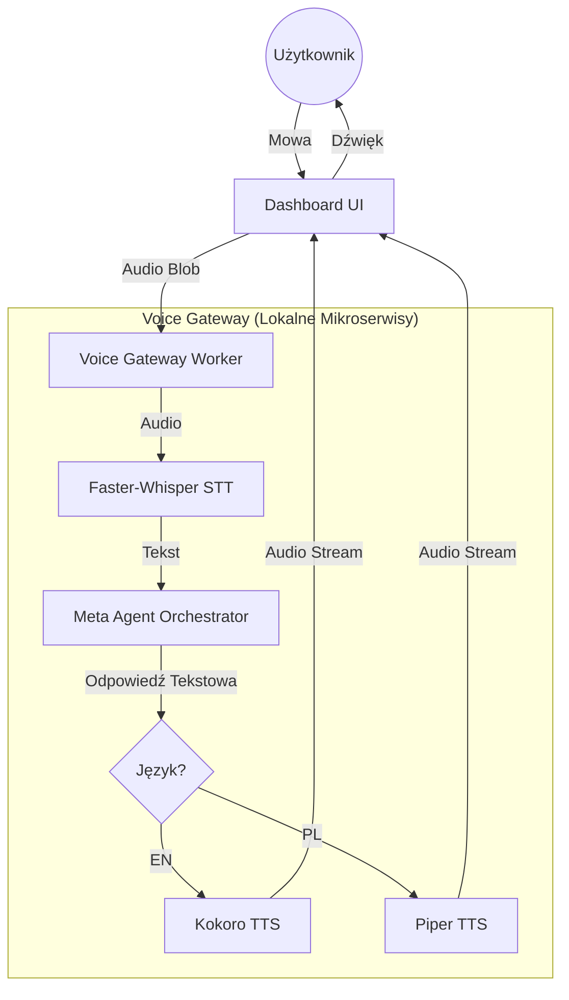

# Plan Implementacji Komunikacji Głosowej (Local-First)

Ten dokument opisuje architekturę i kroki wdrożenia warstwy głosowej (STT i TTS) dla Meta Agenta w projekcie `jarvis-dashboard-agent`.

## 1. Architektura Systemu (Voice Gateway)

Warstwa głosowa działa jako "Brama" nad Meta Agentem. Dzięki temu logika agenta (`react-loop.ts`) pozostaje niezależna od sposobu wprowadzania danych (tekst/głos).

## 2. Wybór Technologii (Lokalne)

| Komponent | Technologia | Rola | Języki |
| :--- | :--- | :--- | :--- |
| **STT** | **Faster-Whisper (Large-v3)** | Zamiana mowy na tekst. | PL, EN |
| **TTS (Premium EN)** | **Kokoro-82M** | Synteza głosu o jakości studyjnej. | EN |
| **TTS (Fast PL)** | **Piper** | Szybka synteza polskiego głosu. | PL |
| **Orkiestracja** | **Node.js/NestJS** | Integracja wewnątrz `apps/workers`. | N/A |

## 3. Etapy Wdrożenia

### Etap 1: Lokalna Infrastruktura (Docker)
Uruchomienie modeli jako osobne kontenery z API kompatybilnym z OpenAI (ułatwia integrację).
- Kontener `faster-whisper-server` (obsługa wielu języków).
- Kontener `kokoro-tts` (dla sesji angielskich).
- Kontener `piper-tts` (z modelem `pl_PL-gosia-medium`).

### Etap 2: Voice Gateway w Backendzie (`apps/workers`)
Stworzenie usługi `VoiceService`, która:
1. Przyjmuje plik audio z Dashboardu.
2. Wysyła go do Whisper i odbiera tekst + wykryty język.
3. Przekazuje tekst do istniejącego Meta Agenta.
4. Na podstawie wykrytego języka wybiera model TTS (Kokoro/Piper).
5. Zwraca do UI tekst odpowiedzi oraz link/stream do audio.

### Etap 3: Interfejs Głosowy w Frontendzie (`apps/dashboard`)
Aktualizacja `MetaAgentChat.tsx`:
1. Dodanie przycisku mikrofonu.
2. Implementacja `MediaRecorder` do przechwytywania głosu.
3. Dodanie wizualizacji "Agent mówi" (fale dźwiękowe).
4. Automatyczne odtwarzanie otrzymanego audio.

## 4. Optymalizacja Opóźnień (Latency)

Aby rozmowa była naturalna:
- **Streaming STT:** Wysyłanie mniejszych paczek audio do Whisper.
- **VAD (Voice Activity Detection):** Wykrywanie ciszy w przeglądarce, aby natychmiast przerwać nagrywanie i zacząć procesowanie.
- **Parallel processing:** Rozpoczęcie generowania audio (TTS) zaraz po tym, jak Meta Agent wygeneruje pierwsze pełne zdanie w `finalAnswer`.

## 5. Przyszłe Rozszerzenia
- **Własne Głosy (Cloning):** Możliwość dodania modelu do klonowania głosu (np. OpenVoice V2).
- **Filler Words:** Dodanie krótkich komunikatów typu "Mhm", "Sprawdzam to..." generowanych w trakcie pracy narzędzi w pętli ReAct.
