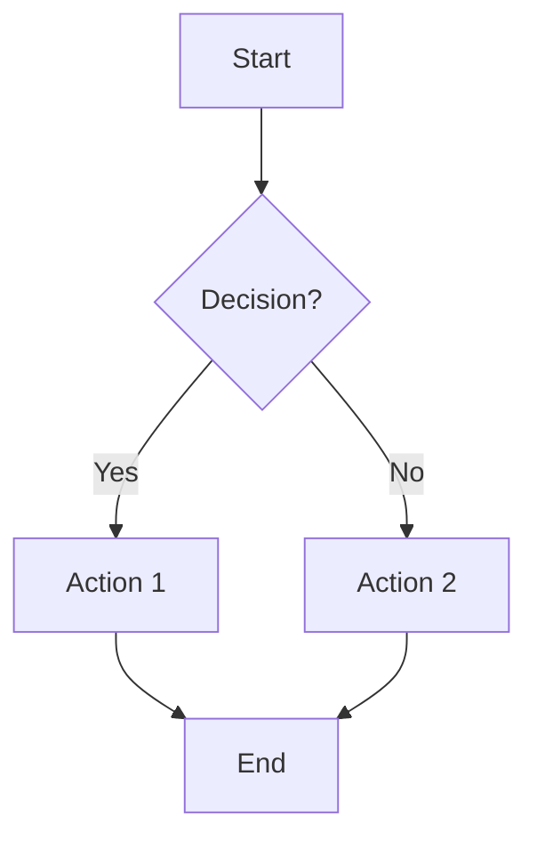
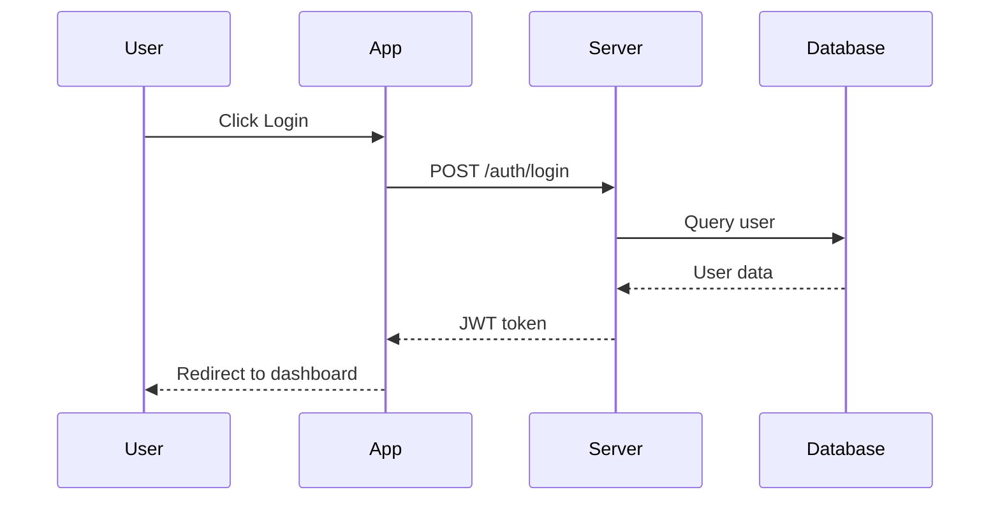
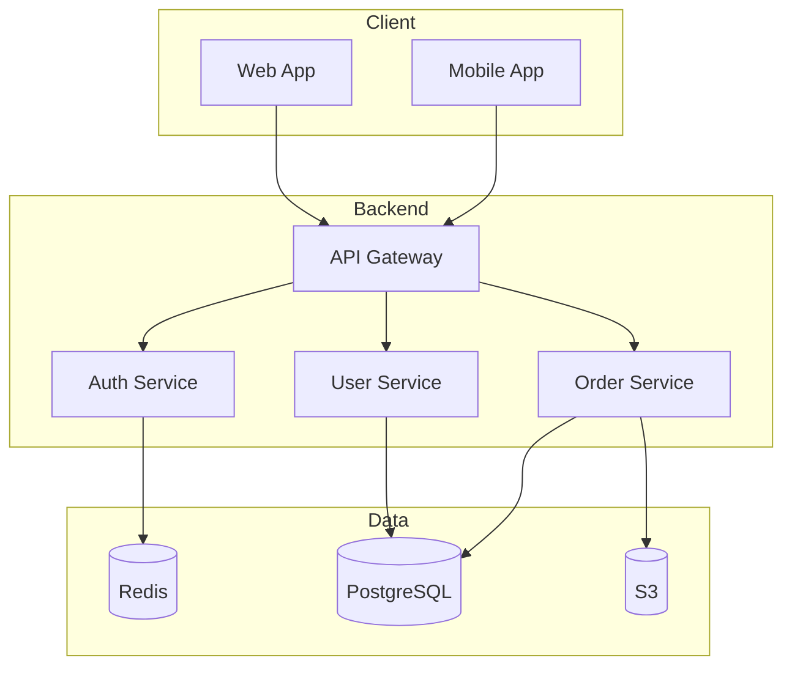
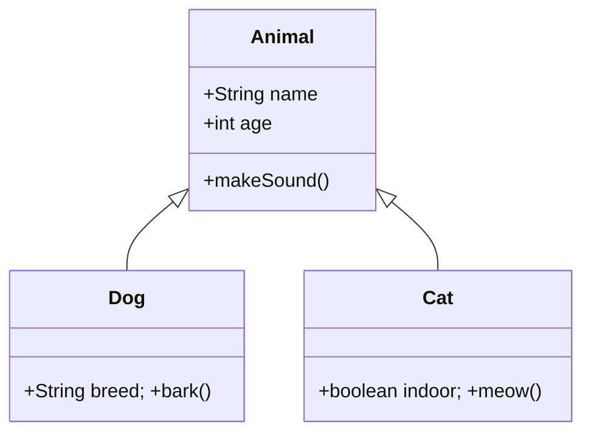
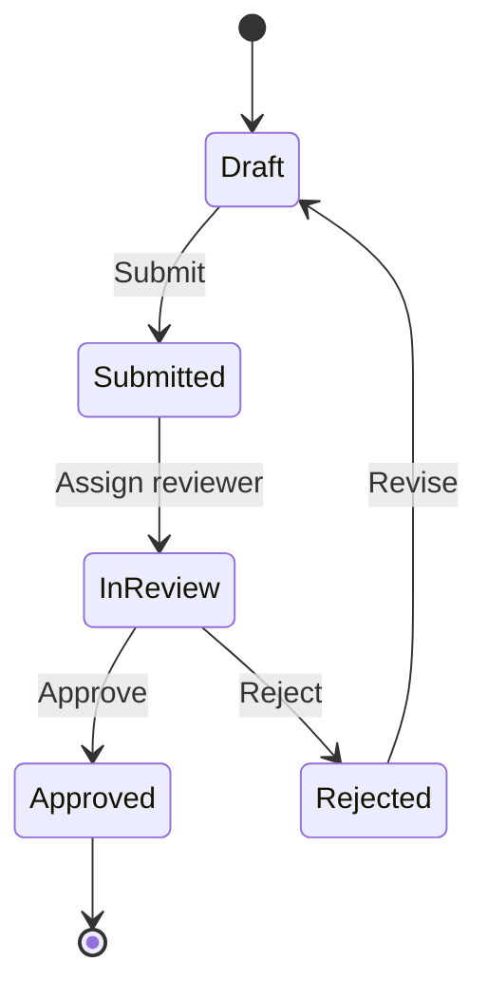
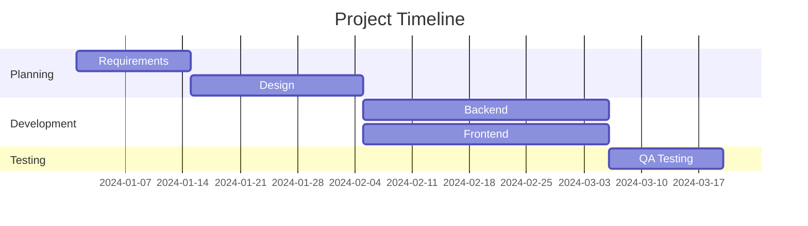
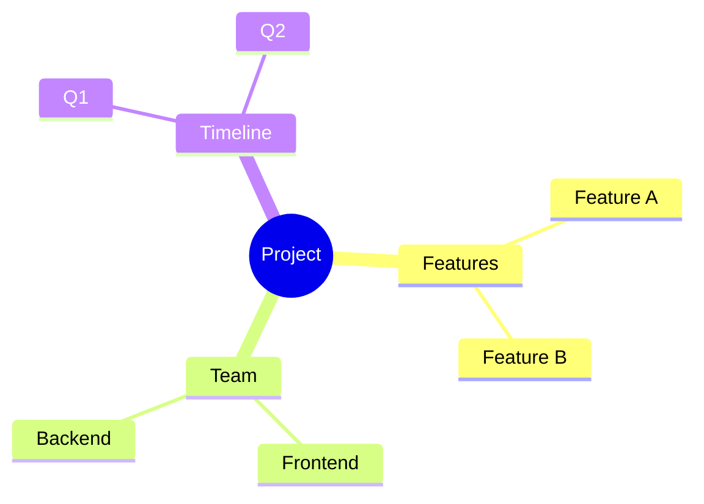
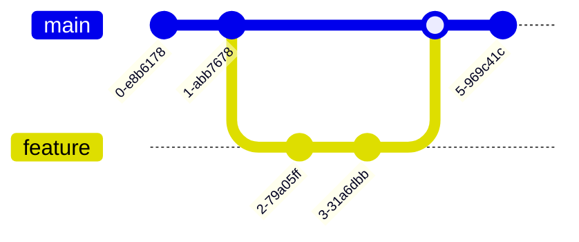
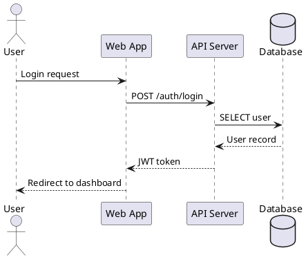

# Diagram Creator

## Overview
Create professional diagrams using text-based tools — **Mermaid** (for web/markdown/GitHub) and **PlantUML** (for complex UML).

## 1. Flowchart / Process Diagram
**Use for**: Business processes, decision trees, workflows


## 2. Sequence Diagram
**Use for**: API calls, user interactions, system communication


## 3. Architecture Diagram
**Use for**: System design, infrastructure


## 4. Entity-Relationship Diagram
**Use for**: Database design, data models
```mermaid
erDiagram
    CUSTOMER ||--o{ ORDER : places
    ORDER ||--|{ LINE_ITEM : contains
    PRODUCT ||--o{ LINE_ITEM : "ordered in"
    CUSTOMER { int id PK; string name; string email }
    ORDER { int id PK; date created_at; int customer_id FK }
    PRODUCT { int id PK; string name; decimal price }
```

## 5. Class Diagram
**Use for**: OOP design, code structure


## 6. State Diagram
**Use for**: State machines, status workflows


## 7. Gantt Chart
**Use for**: Project timelines, schedules


## 8. Mind Map
**Use for**: Brainstorming, concept organization


## 9. Git Graph
**Use for**: Branch visualization, git workflows


## Customization

### Themes
```
%%{init: {'theme':'forest'}}%%
```
Available: `default`, `forest`, `dark`, `neutral`

### Direction
- `TB` (top to bottom), `BT` (bottom to top)
- `LR` (left to right), `RL` (right to left)

## PlantUML Alternative


## Rendering Tools
| Tool | URL | Best For |
|------|-----|----------|
| Mermaid Live | mermaid.live | Quick editing |
| PlantUML Server | plantuml.com | PlantUML |
| GitHub | paste in .md | Native rendering |
| VS Code | Mermaid extension | Local preview |

## Tips
1. **Keep it simple** — don't overcrowd
2. **Use consistent naming** — clear, descriptive labels
3. **Group related items** — use subgraphs/packages
4. **Choose appropriate type** — match diagram to concept
5. **Add legends** — when using symbols/colors
